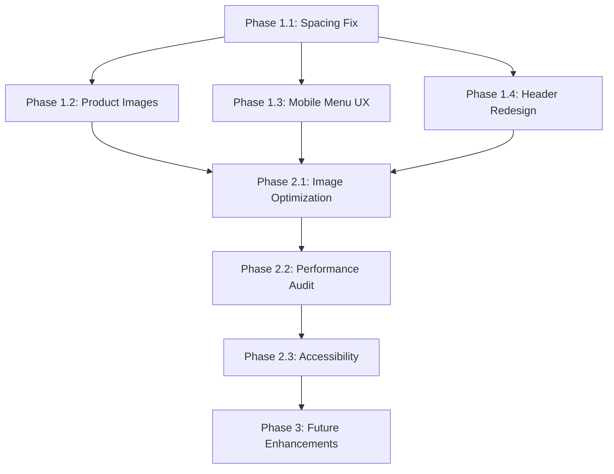

# 🧪 Lab Station - Implementation Roadmap

**Created**: 2026-01-29  
**Based On**: [PROJECT_AUDIT.md](./PROJECT_AUDIT.md)  
**Current Status**: MVP Phase (85-90% Complete)  
**Goal**: Complete MVP and prepare for launch

---

## 🎯 Project Vision

Lab Station is an **experience-first showcase website** for a premium Tunisian fast-food brand. The site must deliver a gaming-like, immersive experience that is "haja masaretch" (never seen before) while maintaining performance for Tunisian 4G networks.

**Constitution Alignment**: All phases must respect the Lab Station identity - industrial/premium aesthetic, character-centric storytelling, Derja-Tech bilingual content, and mobile-optimized performance.

---

## 📊 Architecture Overview

### Current Architecture (Solid Foundation ✅)

```
┌─────────────────────────────────────────────────────────┐
│                    Next.js 16 App Router                │
│                    (Single Page App)                    │
├─────────────────────────────────────────────────────────┤
│  PageLoader → WelcomeOverlay → Hero → Menu →           │
│  Testimonials → Story → VideoBanner → Contact → Footer │
├─────────────────────────────────────────────────────────┤
│              Framer Motion (Animations)                 │
│              Lenis (Smooth Scroll)                      │
│              Tailwind v4 (Design System)                │
└─────────────────────────────────────────────────────────┘
```

### Data Flow

```
Static Data (No Backend)
├── Menu Data (menu-data.ts) → 14 Burgers + 8 Tacos
├── Testimonials (hardcoded) → 6 reviews
└── Restaurant Info (hardcoded) → Contact, social links

Future: Google Places API → Live reviews (Phase 3)
```

### Component Architecture

```
src/components/
├── layout/          → Header, Footer (global)
├── sections/        → Page sections (Hero, Menu, etc.)
├── menu/            → Menu-specific sub-components
└── ui/              → Reusable UI primitives
```

**Decision**: Keep single-page architecture. No routing needed for MVP.

---

## 🚀 Implementation Phases

---

## Phase 1: Critical MVP Blockers 🔴

**Goal**: Fix UX issues and missing assets to reach launch-ready state  
**Timeline**: 2-3 days  
**Priority**: CRITICAL - Must complete before launch

### 1.1 Spacing & Padding Standardization

**Problem**: Inconsistent vertical rhythm and padding across sections/breakpoints  
**Impact**: Site feels unpolished, breaks visual flow

**Tasks**:

- [ ] **Audit all sections** for vertical spacing compliance
  - Target: `py-32` for major sections (Hero, Menu, Story, etc.)
  - Check: `py-24`, `py-28` variations that break rhythm
- [ ] **Standardize container padding** across breakpoints
  - Mobile: `px-4`
  - Tablet: `px-6`
  - Desktop: `px-8` with `max-w-7xl`
- [ ] **Fix component internal spacing**
  - Cards: Consistent padding (`p-6` or `p-8`)
  - Buttons: Consistent `px-6 py-3` or `px-8 py-4`
  - Review cards, menu cards, footer sections
- [ ] **Create spacing utility classes** in `globals.css`
  - `.section-spacing` → `py-32`
  - `.container-padding` → responsive padding
- [ ] **Test on mobile devices** (not just DevTools)

**Files to Edit**:

- `src/components/sections/Hero.tsx`
- `src/components/sections/menu.tsx`
- `src/components/sections/testimonials.tsx`
- `src/components/sections/story.tsx`
- `src/components/sections/contact.tsx`
- `src/components/sections/footer.tsx`
- `src/app/globals.css`

**Success Criteria**: Visual rhythm is consistent, no jarring spacing jumps between sections

---

### 1.2 Product Images Generation

**Problem**: All 22 product images are missing (404 errors in Menu section)  
**Impact**: Menu section is broken, unprofessional

**Tasks**:

- [ ] **Generate 22 product images** using AI (Midjourney/DALL-E/Stable Diffusion)
  - 14 burger images
  - 8 taco images
  - Style: Premium food photography, dark background, Lab Station aesthetic
- [ ] **Optimize images** to WebP format
  - Target: <200KB per image
  - Use Next.js Image component for auto-optimization
- [ ] **Add images** to `/public/images/products/`
- [ ] **Verify image paths** match `menu-data.ts` references
  - Example: `crispy_chicken_burger.png` → `/images/products/crispy_chicken_burger.png`
- [ ] **Test Menu section** on desktop and mobile

**Image Naming Convention** (from menu-data.ts):

```
Burgers:
- crispy_chicken_burger.png
- classic_burger.png
- double_burger.png
- triple_burger.png
- scrambled_eggs_burger.png
- mr_bacon_burger.png
- texas_ribs_burger.png
- 100_meat_burger.png
- brisket_lab_burger.png
- creamy_mushroom_burger.png
- monto_cinto_burger.png
- spicy_burger.png
- truffle_burger.png
- full_cheese_burger.png

Tacos: (8 images needed - check menu-data.ts for exact names)
```

**Success Criteria**: All menu items display product images, no 404 errors

---

### 1.3 Mobile Menu UX Fix

**Problem**: Product drawer requires scrolling to see details (bad UX)  
**Impact**: Poor mobile experience, frustrating for users

**Current Behavior**:

- User taps product → Drawer opens at bottom
- User must scroll down to see drawer content

**Target Behavior**:

- User taps product → Drawer slides up from bottom
- Drawer appears **above** the fold, no scrolling needed
- Smooth animation, easy to dismiss

**Tasks**:

- [ ] **Modify `ProductDrawer.tsx`**
  - Change positioning to fixed bottom with slide-up animation
  - Ensure drawer height is optimized (max 80vh)
  - Add backdrop overlay (dark with opacity)
- [ ] **Add scroll lock** when drawer is open
  - Prevent background scrolling
  - Use `body { overflow: hidden }` or Framer Motion's `AnimatePresence`
- [ ] **Improve close UX**
  - Swipe down to close
  - Tap backdrop to close
  - Close button visible at top
- [ ] **Test on real mobile devices**
  - iPhone (Safari)
  - Android (Chrome)
  - Various screen sizes (small to large)

**Files to Edit**:

- `src/components/menu/product-drawer.tsx`
- `src/components/sections/menu.tsx` (drawer trigger logic)

**Success Criteria**: Drawer appears instantly without scrolling, feels native and smooth

---

### 1.4 Header Premium Redesign

**Problem**: Header feels generic, doesn't match Lab Station's premium identity  
**Impact**: First impression is weak, doesn't set the tone

**Current State**: Basic glassmorphism with yellow accents  
**Target State**: Industrial/premium with hazard stripes, enhanced glow, distinctive logo

**Tasks**:

- [ ] **Enhance logo design**
  - Replace simple "L" with more distinctive mark
  - Add subtle hazard stripe pattern inside logo box
  - Increase glow effect on hover
- [ ] **Add hazard stripe accent**
  - Top or bottom border with diagonal stripes
  - Yellow/black pattern, subtle opacity
- [ ] **Improve navigation hover states**
  - Stronger glow on underline
  - Add subtle "radioactive" pulse effect
- [ ] **Enhance mobile menu**
  - Add grid pattern background (like desktop)
  - Improve animation (slide + fade)
  - Add glow effects to links
- [ ] **Add scroll behavior**
  - Slight background opacity change on scroll
  - Subtle border glow increase

**Files to Edit**:

- `src/components/layout/Header.tsx`
- `src/app/globals.css` (new utility classes)

**Success Criteria**: Header feels premium, industrial, and uniquely "Lab Station"

---

## Phase 2: Polish & Optimization 🟡

**Goal**: Enhance performance and visual quality  
**Timeline**: 1-2 days  
**Priority**: HIGH - Important for launch quality

### 2.1 Image Optimization

**Tasks**:

- [ ] **Compress character images**
  - 9 PNG files (currently 1.8-8 MB each)
  - Convert to WebP format
  - Target: <500KB per image
- [ ] **Implement lazy loading**
  - Use Next.js Image component everywhere
  - Add `loading="lazy"` for below-fold images
- [ ] **Remove unused 3D model**
  - Delete `gas mask character 3d model.glb` (24.9 MB)
  - Or move to separate CDN if needed for future
- [ ] **Optimize grid pattern**
  - Use CSS gradients instead of PNG where possible

**Files to Edit**:

- All components using `<Image>` tags
- `public/images/` directory

**Success Criteria**: Total page weight <5MB, Lighthouse performance score >85

---

### 2.2 Performance Audit

**Tasks**:

- [ ] **Run Lighthouse audit**
  - Performance, Accessibility, Best Practices, SEO
  - Target: 85+ on all metrics
- [ ] **Fix Core Web Vitals**
  - LCP (Largest Contentful Paint) <2.5s
  - FID (First Input Delay) <100ms
  - CLS (Cumulative Layout Shift) <0.1
- [ ] **Optimize animations**
  - Ensure 60fps on mid-range devices
  - Use `will-change` sparingly
  - Prefer `transform` and `opacity` over layout properties
- [ ] **Add loading states**
  - Skeleton screens for images
  - Smooth transitions on load

**Success Criteria**: Lighthouse score 85+, smooth on 4G Tunisian networks

---

### 2.3 Accessibility Improvements

**Tasks**:

- [ ] **Add ARIA labels** to interactive elements
- [ ] **Ensure keyboard navigation** works everywhere
- [ ] **Fix color contrast** issues (if any)
- [ ] **Add focus states** to all interactive elements
- [ ] **Test with screen reader** (NVDA/VoiceOver)

**Success Criteria**: WCAG 2.1 AA compliance, Lighthouse Accessibility score 95+

---

## Phase 3: Future Enhancements 📋

**Goal**: Post-launch improvements and integrations  
**Timeline**: Post-MVP (ongoing)  
**Priority**: MEDIUM - Nice to have, not blockers

### 3.1 Google Reviews Integration

**Tasks**:

- [ ] **Get Google Places API credentials** from Moudi Food
- [ ] **Create API route** in Next.js (`/api/reviews`)
- [ ] **Fetch live reviews** (1000+ reviews)
- [ ] **Replace static testimonials** with live data
- [ ] **Add review filtering** (5-star only, recent, etc.)
- [ ] **Cache reviews** (ISR or SWR)

**Files to Create**:

- `src/app/api/reviews/route.ts`
- `src/lib/google-places.ts`

---

### 3.2 Testing Infrastructure

**Tasks**:

- [ ] **Write E2E tests** (Playwright)
  - Hero section loads correctly
  - Menu filtering works
  - Mobile drawer opens/closes
  - Contact form validation
- [ ] **Write unit tests** (Vitest)
  - Menu data helpers
  - Utility functions
- [ ] **Set up CI/CD**
  - GitHub Actions for test automation
  - Deploy previews on Vercel

**Target Coverage**: 60%+ for critical paths

---

### 3.3 Analytics & Monitoring

**Tasks**:

- [ ] **Add analytics** (Google Analytics or Plausible)
- [ ] **Track key events**
  - Scroll depth
  - CTA clicks ("Order Now", "Lancer le Protocole")
  - Menu interactions (category switches, product views)
- [ ] **Set up error monitoring** (Sentry)

---

### 3.4 Optional Enhancements

**Tasks**:

- [ ] **3D Character Integration** (if performance allows)
  - Load GLB model conditionally (desktop only)
  - Add interactive 3D character in Hero
- [ ] **Instagram Video Integration**
  - Use Instagram API for live video embeds
  - Auto-update VideoBanner section
- [ ] **Transitions Spec (007)**
  - Implement page transition animations
  - Add section reveal effects

---

## 🔄 Dependencies & Order



**Critical Path**: 1.1 → 1.2 → 1.3 → 1.4 → 2.1 → 2.2 → Launch

---

## 📋 Implementation Strategy

### For Each Phase Item:

1. **Run `/speckit-specify`** to create detailed requirements
2. **Run `/speckit-plan`** to create technical implementation plan
3. **Run `/speckit-tasks`** to generate actionable task list
4. **Run `/speckit-implement`** to execute the work
5. **Run `/speckit-verify`** to validate completion

### Recommended Order:

1. **Start with Phase 1.1** (Spacing) - Foundation for everything else
2. **Parallel work**: 1.2 (Images) and 1.3 (Mobile UX) can be done simultaneously
3. **Finish with 1.4** (Header) - Visual polish
4. **Phase 2** after Phase 1 is 100% complete
5. **Phase 3** post-launch

---

## 🎯 Success Metrics

### MVP Launch Criteria (Phase 1 + 2 Complete):

- ✅ All spacing is consistent (`py-32` rhythm)
- ✅ All 22 product images are present and optimized
- ✅ Mobile menu UX is smooth (no scrolling needed)
- ✅ Header feels premium and distinctive
- ✅ Lighthouse score: 85+ (Performance, Accessibility, Best Practices, SEO)
- ✅ Page weight: <5MB
- ✅ Works smoothly on 4G Tunisian networks
- ✅ No console errors or warnings
- ✅ Tested on real devices (iOS + Android)

### Post-Launch Goals (Phase 3):

- ✅ Live Google Reviews integration
- ✅ 60%+ test coverage
- ✅ Analytics tracking active
- ✅ Error monitoring in place

---

## 🚦 Next Steps

### Immediate Action:

```bash
/speckit-specify
```

**For**: Phase 1.1 - Spacing & Padding Standardization

This will create a detailed spec in `specs/008-spacing-fix/` with:

- Exact spacing values for each section
- Breakpoint-specific padding rules
- Component-level spacing standards
- Testing checklist

---

## 📝 Notes

### Design Decisions:

1. **No Backend Needed**: Static site is sufficient for MVP. Google Reviews can be added via API routes later.
2. **Single Page App**: No routing needed. Smooth scroll navigation is perfect for showcase site.
3. **Tailwind v4**: Using CSS-based config (`@theme` in `globals.css`) - this is correct, no `tailwind.config.ts` needed.
4. **Image Strategy**: WebP format with Next.js Image optimization for best performance.
5. **Mobile-First**: All fixes must prioritize mobile UX (80% of Tunisian traffic).

### Risk Mitigation:

- **Performance**: Remove heavy 3D model, optimize all images, lazy load below-fold content
- **Browser Compatibility**: Test on Safari (iOS) and Chrome (Android) - primary targets
- **Network Conditions**: Test on throttled 4G to simulate Tunisian networks

---

**Last Updated**: 2026-01-29  
**Maintained By**: Antigravity AI Agent  
**Status**: Ready for Phase 1 execution 🚀
